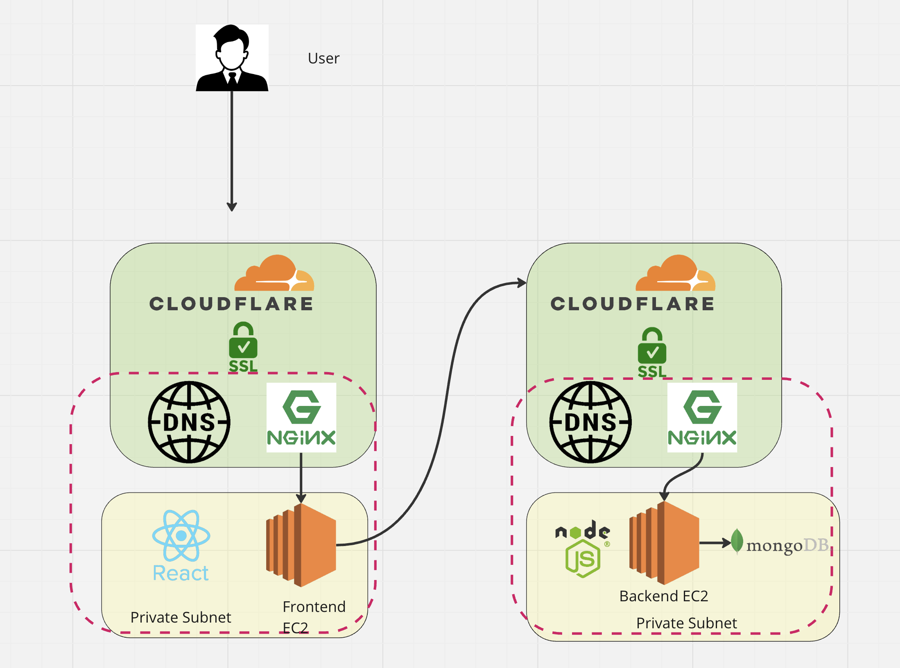

# Deployment Documentation for MERN Architecture

## Overall Architecture




## Step 1: Setting up AWS EC2 Instances

1. **Objective**: Create two EC2 instances on AWS, one for the frontend and one for the backend.

2. **Details**:
   - **Instance Creation**: Log into your AWS account, navigate to the EC2 dashboard, and create two instances. Select the appropriate instance type (e.g., `t2.micro` for testing purposes).
   - **Operating System**: Choose an appropriate Linux distribution, such as Ubuntu Server.

3. **Installation of Nginx and Cloning Repository**:
   - **Nginx Installation**:
     ```
     sudo apt update
     sudo apt install nginx -y
     ```
   - **Repository Cloning**:
     ```
     git clone https://github.com/UnpredictablePrashant/TravelMemory.git
     ```
     Execute this command in a directory where you want the repository to be cloned.

4. **Verification**:
   - Ensure Nginx is installed and running: `systemctl status nginx`
   - Confirm the repository is cloned: Check the directory for the `TravelMemory` folder.


## Step 2: Configuring AWS Security Group for Port Access

1. **Objective**: Open TCP port 3000 in the AWS Security Group to allow traffic for both frontend and backend applications.

2. **Steps**:
   - Navigate to the AWS EC2 dashboard.
   - Select the relevant EC2 instance (one at a time).
   - Under the 'Security' tab, find the associated security group and click on it.
   - In the security group, select the 'Inbound rules' tab.
   - Click on 'Edit inbound rules'.
   - Add a new rule:
     - **Type**: Custom TCP
     - **Port Range**: 3000
     - **Source**: Custom (0.0.0.0/0) for global access, or specify as needed.
   - Save the rule.

3. **Verification**:
   - After adding and saving the rule, ensure that port 3000 is listed in the inbound rules for both instances' security groups.

4. **Note**:
   - Opening port 3000 to 0.0.0.0/0 (all IP addresses) is for ease of access, but consider limiting access to specific IP addresses for production environments for better security.

## Step 3: Configuring MongoDB and Database Creation

1. **Objective**: Set up MongoDB, create a database named `travelMemory`, and configure network access for EC2 instances.

2. **MongoDB Configuration**:
   - Access your MongoDB account and navigate to the Network Access settings.
   - Add the IP address of your backend EC2 instance to allow it to connect to MongoDB. Alternatively, use `0.0.0.0/0` for access from any IP (not recommended for production environments).
   - Ensure MongoDB is set up to listen on the default port (27017).

3. **Database Creation**:
   - Use either the MongoDB Atlas UI or the `mongosh` shell to create a new database named `travelMemory`.
   - In `mongosh`, the command would look like this after connecting to your MongoDB instance:
     ```mongo
     use travelMemory
     ```
     This command switches to the `travelMemory` database, creating it if it doesn't exist.

4. **Verification**:
   - Confirm that the database `travelMemory` exists in your MongoDB instance.
   - Verify that your backend EC2 instance can connect to MongoDB using the command `mongosh` with the connection string.

5. **Security Note**:
   - Be cautious when using `0.0.0.0/0` for MongoDB Network Access. It's advisable to restrict access to specific IP addresses, especially in a production environment.


## Step 4: Installing Node.js on EC2 Instances

1. **Objective**: Uninstall any existing Node.js installation and install a newer version of Node.js (higher than v18) on both frontend and backend EC2 instances.

2. **Uninstall Existing Node.js** (if any):
   - Run the following commands to remove any existing Node.js versions:
     ```
     sudo apt-get remove nodejs npm -y
     sudo apt-get autoremove -y
     ```

3. **Install Node.js**:
   - Fetch the Node.js setup script and execute it:
     ```
     curl -sL https://deb.nodesource.com/setup_current.x | sudo -E bash -
     ```
   - Install Node.js:
     ```
     sudo apt-get install -y nodejs
     ```

4. **Verification**:
   - Check the installed version of Node.js to ensure it's higher than v18:
     ```
     node -v
     ```

5. **Note**:
   - The `setup_current.x` script fetches the latest current release of Node.js. Ensure that this version is suitable for your project requirements.
   - It's important to uninstall existing versions of Node.js to avoid version conflicts.

## Step 5: Setting up the Backend Server

1. **Objective**: Configure the backend server environment, install necessary packages, and start the backend application.

2. **Environment File and MongoDB Connection**:
   - Navigate to the backend folder within the cloned `TravelMemory` repository.
   - Create a `.env` file to store environment variables:
     ```
     touch .env
     ```
   - Edit the `.env` file and add the following fields:
     - `MONGO_URI` = Your MongoDB connection URI, formatted as: 
       ```
       mongodb+srv://{user_name}:{password}@{cluster_name}.mongodb.net/{database_name}
       ```
     - `PORT` = 3000 (or your desired port number).

3. **Install Packages and Start Application**:
   - Install necessary packages:
     ```
     npm install
     ```
   - Start the application:
     ```
     node index.js
     ```

4. **Verification**:
   - Open a web browser and navigate to `http://[your-backend-EC2-instance-IP]:3000` to ensure the backend server is up and running.
   - Use `mongosh` to verify the MongoDB connection.
   - Check the backend logs for any errors. These can typically be found in the console output or log files within the project directory.

5. **Note**:
   - Make sure the MongoDB URI in the `.env` file matches the URI provided by MongoDB Atlas or your MongoDB server.
   - Ensure the backend server is running and can connect to MongoDB before proceeding to configure the frontend.

## Step 6: Setting up the Frontend Server

1. **Objective**: Configure the frontend server, update necessary files, install packages, and start the frontend application.

2. **Updating Backend URL**:
   - Navigate to the `frontend/src` directory within the cloned `TravelMemory` repository.
   - Edit the `url.js` file to update the backend server's IP address and port number. Ensure the format is like `http://[backend-IP-address]:3000` (without a trailing slash).

3. **Install Frontend Packages and Start Application**:
   - In the frontend directory of the repository, execute the following commands:
     ```
     npm install
     npm start
     ```

4. **Running in the Background** (Optional):
   - If you want the frontend app to run in the background:
     ```
     nohup npm start > nohup.log 2>&1 &
     ```
   - Verify the process is running with:
     ```
     ps -ef | grep npm
     ```

5. **Verification**:
   - Open a web browser and navigate to `http://[your-frontend-EC2-instance-IP]:3000` to ensure the frontend server is up and running.
   - Check the `nohup.log` file or the console for any startup errors.

6. **Note**:
   - Ensure Node.js is properly installed on the frontend server as per the previous steps.
   - The URL in `url.js` must correctly point to the backend server for the frontend to function properly.


## Step 7: Running Applications in Background and Process Management

1. **Objective**: Ensure both frontend and backend applications run in the background and are properly managed.

2. **Running Applications in Background**:
   - For the backend server, inside the backend directory, run:
     ```
     nohup node index.js > nohup.log 2>&1 &
     ```
   - For the frontend server, inside the frontend directory (as previously mentioned):
     ```
     nohup npm start > nohup.log 2>&1 &
     ```
   These commands will start the applications in the background and log the output to `nohup.log`.

3. **Process Management**:
   - Check if the applications are running:
     ```
     ps -ef | grep node
     ```
     ```
     ps -ef | grep npm
     ```
   These commands will list the running Node.js and npm processes, helping you verify that your applications are active.

4. **Verification**:
   - Ensure that the output of the `ps -ef` commands shows the node and npm processes running.
   - Check the `nohup.log` files in both frontend and backend directories for any error logs or startup messages.

5. **Note**:
   - Using `nohup` allows the applications to run even after the SSH session is closed. The `&` at the end of the command puts the process in the background.
   - Regularly monitoring the log files can be crucial for early detection of issues.

## Step 8: Setting Up and Configuring Nginx

1. **Objective**: Install and configure Nginx on both frontend and backend EC2 instances to serve the applications.

2. **Nginx Installation and Initial Setup**:
   - Install Nginx if not already installed:
     ```
     sudo apt install nginx -y
     ```
   - Start the Nginx service:
     ```
     sudo systemctl start nginx
     ```
   - Check the status to ensure it's running:
     ```
     sudo systemctl status nginx
     ```
   - Optionally, adjust the firewall settings:
     ```
     sudo ufw allow 'Nginx Full'
     ```

3. **Nginx Configuration**:
   - Backup the original Nginx configuration file:
     ```
     sudo cp /etc/nginx/sites-available/default /etc/nginx/sites-available/default.bak
     ```
   - Edit the Nginx configuration file (`/etc/nginx/sites-available/default`) using a text editor like `nano` or `vim`.
   - Comment out the following lines:
     ```
     root /var/www/html;
     index index.html index.htm index.nginx-debian.html;
     try_files $uri $uri/ =404;
     ```
   - Add the following lines inside the `location / { }` block:
     ```
     proxy_pass http://localhost:3000;
     proxy_http_version 1.1;
     proxy_set_header Upgrade $http_upgrade;
     proxy_set_header Connection 'upgrade';
     proxy_set_header Host $host;
     proxy_cache_bypass $http_upgrade;
     ```

4. **Testing and Restarting Nginx**:
   - Test the configuration:
     ```
     sudo nginx -t
     ```
   - If the test is successful, restart Nginx to apply changes:
     ```
     sudo systemctl restart nginx
     ```

5. **Verification**:
   - Ensure Nginx is running without errors and is properly forwarding requests to the application running on port 3000.
   - Access your EC2 instance's public IP in a browser to check if the application is being served by Nginx.

6. **Note**:
   - Be sure to modify the Nginx configuration for both frontend and backend servers accordingly.
   - Regularly check the Nginx logs for any errors or issues.

## Step 9: Finalizing Configuration and Removing Direct Port Access

1. **Objective**: Secure the application by finalizing the Nginx configuration and removing direct access to port 3000.

2. **Removing Direct Port Access**:
   - Return to the AWS Security Group settings for both EC2 instances.

3. **Verification**:
   - Access the application using the EC2 instance's public IP or DNS. The application should be accessible without specifying port 3000.

4. **Note**:
   - This step increases security by preventing direct external access to the application ports, ensuring all traffic is managed by Nginx.
   - Ensure you have configured Nginx correctly before removing direct port access to avoid losing access to your application.

## Step 10: Domain Purchase, DNS Configuration, and CloudFlare Setup

1. **Objective**: Acquire a domain name, configure DNS records for the application, and set up CloudFlare for CDN and web security.

2. **Domain Purchase**:
   - Visit a domain registrar like GoDaddy.
   - Search for your desired domain name and complete the purchase process.

3. **DNS Configuration at Registrar**:
   - Log in to your domain registrar's dashboard.
   - Navigate to the DNS management section.
   - Add an A record:
     - **Type**: A
     - **Name**: @
     - **Value**: [IP of your frontend EC2 instance]
     - **TTL**: 600 (or as per your preference)

4. **Setting up CloudFlare**:
   - Register and log in to CloudFlare.
   - Add your new domain to CloudFlare and select the free plan.
   - Follow the instructions to change your domain's nameservers to CloudFlare's nameservers.
   - After nameserver update, go to the DNS section in CloudFlare.
   - Add an A record for the frontend server and another for the backend server:
     - Frontend: **Type**: A, **Name**: [domain_name], **IP Address**: [frontend EC2 IP], **Proxy status**: DNS only (unproxied)
     - Backend (API): **Type**: A, **Name**: api, **IP Address**: [backend EC2 IP], **Proxy status**: DNS only (unproxied)

5. **Updating Frontend Application**:
   - Update the `frontend/src/url.js` file to use the new backend API URL (http://api.[your_domain_name]).

6. **Restart and Verification**:
   - Restart both frontend and backend applications to apply the changes.
   - Access your domain name via HTTP and verify that the application is functioning correctly.

7. **Note**:
   - It might take some time for DNS changes to propagate.
   - The use of CloudFlare provides additional security and performance benefits through its CDN and web protection features.


## Step 11: Implementing SSL with Certbot

1. **Objective**: Secure your application by installing an SSL certificate using Certbot on both the frontend and backend EC2 instances.

2. **Certbot Installation**:
   - First, ensure snapd is installed and up to date:
     ```
     sudo apt-get update
     sudo apt-get install snapd
     ```
   - Remove any existing Certbot installations (if any):
     ```
     sudo apt-get remove certbot
     ```
   - Install Certbot using snap:
     ```
     sudo snap install --classic certbot
     sudo ln -s /snap/bin/certbot /usr/bin/certbot
     ```

3. **Obtaining SSL Certificate**:
   - Run Certbot with the Nginx plugin:
     ```
     sudo certbot --nginx
     ```
   - Follow the on-screen instructions to select your domain and obtain the certificate. Certbot will automatically modify the Nginx configuration to use the SSL certificate.

4. **Testing and Restarting Nginx**:
   - Test the Nginx configuration for syntax errors:
     ```
     sudo nginx -t
     ```
   - Restart Nginx to apply the new configuration:
     ```
     sudo systemctl restart nginx
     ```

5. **Verification**:
   - Access your application using `https://[your-domain-name]` to verify that SSL is working correctly.
   - You should see a secure (padlock) icon in the browser's address bar.

6. **Automating Certificate Renewal**:
   - Set up a cron job for automatic certificate renewal:
     ```
     echo "0 12 * * * /usr/bin/certbot renew --quiet" | sudo tee -a /etc/crontab > /dev/null
     ```
   - This cron job will attempt to renew the certificate daily at noon.

7. **Updating Frontend Configuration**:
   - Update the `frontend/src/url.js` file to use HTTPS for the backend URL.
   - Restart the frontend application to apply the change.

8. **Note**:
   - SSL certificates provided by Certbot are typically valid for 90 days. The cron job ensures they are renewed automatically.
   - Ensure that both the frontend and backend Nginx configurations are updated and tested after SSL implementation.
